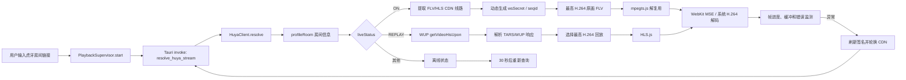

# 栖流虎牙直播源系统技术文档

> 适用版本：栖流 1.0.0
> 文档状态：与当前源码一致
> 最后验证：2026-08-31
> 主要实现：`src-tauri/src/huya.rs`、`src-tauri/src/huya_wup.rs`、`src/playback-supervisor.ts`

## 1. 文档目的

本文记录栖流获取、选择和播放虎牙直播源的完整实现，以及开发过程中实际遇到的故障、诊断证据和最终解决方案。它既是当前架构说明，也是虎牙接口或播放器行为变化后的排障手册。

需要先明确两点：

1. 本项目使用的是虎牙网页和客户端当前可访问的接口、字段及签名规则，不是虎牙公开承诺稳定的开发者 API。
2. 文中“已确认”表示由当前源码、单元测试或一次明确的现场测试支持；对虎牙服务端内部原因的描述会标为“工程推断”，不能当作平台协议保证。

## 2. 目标、约束与非目标

### 2.1 目标

- 接受一个虎牙房间链接，启动后直接播放。
- 区分直播、回放和离线三种房间状态。
- 直播优先使用最高 H.264 原画和稳定的 CDN 线路。
- 回放选择网页当前可用的最高 H.264 清晰度，并尽量对齐网页进度。
- 发生签名失效、CDN 断线、解码停滞或应用从后台恢复时先刷新同一线路；只有短时间连续失败才换备用 CDN。
- 向设置面板提供主播、画质、码率、分辨率、帧率、缓冲、掉帧和线路信息。

### 2.2 约束

- Tauri 2 + macOS WKWebView；媒体最终交给系统 WebKit/MSE/H.264 解码。
- 前端不持有虎牙签名算法之外的网络解析逻辑，房间解析统一放在 Rust 端。
- 不打包 FFmpeg、VLC 或 libmpv。
- 只保存一个房间链接，不维护账号、Cookie 或播放历史。

### 2.3 非目标

- 不承诺外部网络、虎牙 CDN、主播推流永不抖动。
- 不绕过付费、登录、区域或平台权限。
- 当前不支持 H.265、弹幕、多房间、多画面和手动画质选择。
- 当前恢复机制是“重新解析并替换播放器”，不是两个播放器重叠切换，因此线路切换仍可能产生短暂空档。

## 3. 系统总览



直播和回放不是同一套地址：

| 房间状态 | 地址来源 | 容器/协议 | 前端播放器 |
| --- | --- | --- | --- |
| `ON` | `profileRoom` 返回的 `baseSteamInfoList` + 动态签名 | HTTP-FLV 长连接，必要时才退回 HLS 地址 | mpegts.js + MSE |
| `REPLAY` | WUP `liveui.getVideoHisUpon`，失败时才使用房间信息中的低能力回退地址 | HLS | HLS.js |
| 其他 | 无媒体地址 | 无 | 等待并定时重新解析 |

## 4. 模块职责

| 文件 | 职责 |
| --- | --- |
| `src-tauri/src/lib.rs` | 注册统一 Tauri 命令 `resolve_live_stream`，按链接平台分发到长生命周期客户端。 |
| `src-tauri/src/huya.rs` | 链接校验、房间信息请求、状态识别、直播线路排序、原画选择、动态签名和回放 URL 校验。 |
| `src-tauri/src/huya_wup.rs` | 构造/解析 TARS/WUP 二进制包、获取回放列表、选择最高 H.264 回放及同步位置。 |
| `src/playback-supervisor.ts` | 播放状态机、mpegts.js/HLS.js 生命周期、卡顿监测、换线、退避、降码率和统计。 |
| `src/main.ts` | 管理本地收藏、展示播放状态和统计，不参与虎牙协议解析。 |
| `src-tauri/tauri.conf.json` | 限制可连接的虎牙域名、媒体来源、图片来源和 WebView 能力。 |

## 5. Rust 与前端之间的数据契约

Rust 的 `HuyaStream` 通过 Tauri 自动转为 camelCase，前端接收同名接口。

| 字段 | 含义 |
| --- | --- |
| `roomId` | 虎牙规范化后的房间号或别名。 |
| `title` | 当前直播/回放标题。 |
| `anchor` | 主播昵称。 |
| `avatarUrl` | 主播头像。 |
| `isLive` | 当前状态是否为直播。 |
| `isReplay` | 当前状态是否为回放。 |
| `url` | 媒体 URL；直播为新签名地址，回放为 HLS 地址，离线时为 `null`。 |
| `lineIndex` / `lineCount` | 当前 CDN 序号和总线路数。 |
| `lineName` | CDN 类型，如 `HS`、`TX`、`AL`。 |
| `qualityLabel` | 虎牙显示名称或本地回退名称。 |
| `bitrate` | 标称码率，单位 kbps；不是实时下载速度。 |
| `startPositionSeconds` | 回放与网页同步的起始秒数；直播为 0。 |
| `format` | `flv`、`hls` 或空字符串。 |

`url` 只在当前连接周期内使用。恢复时不能把旧 URL 当永久地址缓存，必须重新调用 Rust 解析器。

## 6. 房间链接校验

入口是 `parse_room_id`：

1. 去掉首尾空白；空值直接拒绝。
2. 没有协议时补 `https://`。
3. 只接受 `http` 或 `https`。
4. 主机必须等于 `huya.com` 或以 `.huya.com` 结尾。
5. 取第一个非空路径段作为房间号。
6. 房间号最长 64 字节，只允许 ASCII 字母、数字、`_` 和 `-`。

这可以接受数字房间号和部分英文别名，同时阻止把 Tauri 后端变成任意 URL 请求器。

```text
https://www.huya.com/196645?from=home -> 196645
www.huya.com/kaerlol                 -> kaerlol
https://example.com/196645           -> 拒绝
```

## 7. 房间信息请求与状态识别

### 7.1 请求

Rust 请求：

```text
GET https://mp.huya.com/cache.php
    ?m=Live
    &do=profileRoom
    &roomid=<roomId>
    &showSecret=1
```

请求附带移动端 User-Agent、虎牙 `Origin` 和 `Referer`。`reqwest::Client` 的关键限制为：建连超时 8 秒、整体请求超时 15 秒、TCP keepalive 30 秒、空闲连接池超时 90 秒、每主机最多 2 条空闲连接、最多 3 次重定向，并使用 rustls。

返回体必须满足顶层 `status == 200`，否则不会继续读取媒体字段。

### 7.2 状态机

`data.liveStatus` 被规范化为大写后映射为：

| 虎牙值 | 内部状态 | 行为 |
| --- | --- | --- |
| `ON` | `Live` | 解析直播 CDN 和签名。 |
| `REPLAY` | `Replay` | 获取回放历史与多档清晰度。 |
| 其他/缺失 | `Offline` | 返回主播信息但不给媒体 URL，30 秒后重查。 |

这里不能用“不是 `ON` 就离线”的二分法。开发中已经遇到房间未开播但网页正在播放回放的情况；忽略 `REPLAY` 会把有效内容错误地显示成离线。

## 8. 直播线路提取

### 8.1 读取字段

`extract_live_lines` 遍历 `data.stream.baseSteamInfoList`，每个候选线路读取：

- `sCdnType`：CDN 标识；
- `sFlvUrl` / `sFlvAntiCode`：首选；
- `sHlsUrl` / `sHlsAntiCode`：仅在该项没有完整 FLV 字段时回退；
- `sStreamName`：媒体流名称；
- `lPresenterUid`：签名使用的主播 UID。

UID 缺失时依次尝试 `lPresenterUid`、`sStreamName` 第一个 `-` 前的数字、`profileInfo.uid`。基础地址、anti-code 或流名称任一为空，该线路就被丢弃，避免构造半完整 URL。

### 8.2 线路排序

当前策略固定优先 `HS`，其余线路按虎牙在 `stream.flv.multiLine`（或 HLS 回退字段）中报告的顺序排列，最后追加未出现在优先表中的候选。

例如候选是 `AL、TX、HS`，报告顺序是 `TX、HS`，最终为：

```text
HS -> TX -> AL
```

`lineCursor` 不会因一次孤立错误就增加。当前 CDN 使用新签名重试后，如果 30 秒内再次失败，前端才增加 `lineCursor`；Rust 再用线路数取模选择下一条 CDN。这样既不会在线路数量变化时越界，也避免把虎牙正常会话到期误认为线路质量差。

## 9. 原画与 `ratio` 的真实语义

前端用以下常量请求画质：

```ts
SOURCE_QUALITY_BITRATE_KBPS = 0
FALLBACK_BITRATE_KBPS = 4000
```

虎牙的原画不是把页面显示的“10M/20M”直接写入 `ratio`。当前网页提取规则中：

- `bitrate == 0`：完全省略 `ratio`，表示源画质；
- `bitrate > 0`：附加 `ratio=<kbps>`，请求转码档。

标称码率和请求参数必须分开：原画请求仍然用 0，但设置面板显示的标称码率来自 `liveData.bitRate`。画质名称优先从 JSON 字符串 `liveData.bitRateInfo` 中查找对应 `iBitRate` 的 `sDisplayName`。

### 实际问题：把显示码率当成原画参数

早期实现看到“蓝光 10M”后尝试请求 `ratio=10000`。结果不一定等于网页的源画质，某些房间会返回转码档或不一致内容。

**解决方案：** 原画统一传 0 并删除旧 anti-code 里已有的 `ratio`；只有连续恢复三次后才临时请求 `ratio=4000`。单元测试 `source_quality_omits_ratio_and_uses_huya_nominal_bitrate` 固定了该行为。

## 10. 虎牙直播签名

### 10.1 为什么必须重新签名

房间接口返回的 anti-code 是生成新连接参数的材料，不应被当作长期可复用的完整播放令牌。调试中观察到，同一个已签名媒体地址被重复建立连接时会出现 HTTP 403；刷新房间信息并生成新的 `seqid/wsSecret` 后才能可靠重连。

因此每个首次连接和恢复连接都会重新执行：

```text
PlaybackSupervisor.connect
  -> invoke("resolve_huya_stream")
  -> HuyaClient.resolve
  -> build_play_url
```

### 10.2 计算步骤

设 `antiCode` 为线路查询串，`streamName` 为 `sStreamName`，`uid` 为主播 UID，`nowMs` 为当前 Unix 毫秒，`ctype` 默认 `huya_live`，`t` 默认 `100`。

1. URL-decode anti-code，读取 `fm`、`wsTime`、`ctype`、`t`、`fs`。
2. Base64 解码 `fm`，取第一个 `_` 前的文本作为 `secretPrefix`。
3. 把 `wsTime` 作为十六进制 Unix 秒解析。若已经过期或只剩 5 秒，直接失败并重新取得房间信息。
4. 对非 WAP 平台转换 UID：保留高 32 位，把低 32 位循环左移 8 位。
5. 生成 `seqid = uid + nowMs`。
6. 生成中间哈希：

   ```text
   secretHash = MD5("<seqid>|<ctype>|<t>")
   ```

7. `t == 103` 的 WAP 线路使用原 UID；其他线路使用转换后的 UID。
8. 生成最终签名：

   ```text
   wsSecret = MD5(
     "<secretPrefix>_<calculationUid>_<streamName>_<secretHash>_<wsTime>"
   )
   ```

9. 输出 `wsSecret、wsTime、seqid、ctype、ver=1、fs、fm、t`；WAP 输出 `uid/uuid`，其他线路输出 `u`。
10. 强制 `codec=264`；只有非原画时才输出 `ratio`。
11. 把虎牙返回的 `http://` CDN 基础地址升级为 `https://`，拼接 `.flv` 或 `.m3u8`。

### 10.3 过期处理原则

不能简单把过期 `wsTime` 延长一天再计算。`wsTime` 是服务端给出的签名材料和有效期声明；本项目选择拒绝过期令牌并重新拉取房间信息。测试 `rejects_expired_huya_token_instead_of_inventing_a_new_expiry` 防止未来回归。

## 11. 回放解析：WUP/TARS 链路

### 11.1 实际问题：低清旧片段反复播放

测试房间 `https://www.huya.com/196645` 时曾出现：房间不在直播但网页显示回放；网页可以选择 1080P 且内容在推进；应用只得到约 640×360；播完一小段后又从同一位置重复。

**诊断结论：** 仅使用 `profileRoom.liveData.hlsUrl`/`hls` 只能得到能力有限的回退地址，不能代表网页当前回放的多档清晰度和同步位置。把 `REPLAY` 当普通直播 HLS 处理还会造成旧地址被反复重开。

### 11.2 当前解决方案

1. 从 `profileInfo.uid`，其次从 `liveData.uid` 取得主播 UID。
2. 向 `https://wup.huya.com/` 发送 `application/x-wup` 请求。
3. WUP servant/function 为 `liveui.getVideoHisUpon`。
4. 请求体和响应体使用项目内最小化的 TARS 编解码器，不引入完整 SDK。
5. 从第一条回放历史中读取基础 HLS、`syncTimeSeconds` 以及各清晰度的宽、高、definition、m3u8、名称和 codec。
6. 过滤空 m3u8 后，以以下元组取最大值：

   ```text
   (是否 H.264, 像素数 width*height, definition 数值)
   ```

   空 codec 也按 H.264 兼容处理。这样会优先 H.264，再选最高分辨率和名义档位。
7. 地址升级为 HTTPS，并再次验证域名只能是虎牙。
8. HLS.js 加载元数据后，把 `video.currentTime` 设为不超过媒体结尾的 `syncTimeSeconds`，对齐网页当前回放进度。
9. WUP 失败时才回退到房间信息里的 HLS URL；画质标签明确退回 `360P · 流畅`，不伪装成原画。

### 11.3 防御性解析

- 响应最大 8 MiB；
- 声明长度不能超出实际字节；
- 列表最多 10,000 项；
- Map 最多 128 项；
- 所有读取都做边界检查；
- 未知或类型错误字段返回可读错误；
- 最终媒体地址必须是 HTTPS 虎牙域名。

## 12. 为什么直播从 HLS 改为 FLV 长连接

### 12.1 旧方案的症状

早期直播链路使用 HLS.js 轮询虎牙直播 m3u8，实际出现：播放一段时间后必然进入缓冲；过一段时间自动恢复但观看不连续；某些状态下反复播放少量旧片段；重新使用同一地址时出现 HTTP 403。

### 12.2 现场证据

一次针对虎牙直播 HLS 的调试观察到：

- 清单只包含约 3 个、每个约 4 秒的分片；
- 首次请求成功；
- 稍后重复轮询同一签名地址得到 403；
- 仅改变 `seqid` 但继续复用原连接材料，并不能形成可靠的持续轮询方案。

这些现象与“短清单 + 单连接签名”组合一致。这里对服务端意图不作断言，但工程上可以确认：静态保存并长期轮询该 HLS URL 不可靠。

### 12.3 最终方案

直播优先取同一线路的 `sFlvUrl/sFlvAntiCode`，建立一次持续 HTTP-FLV 连接。mpegts.js 负责：

```text
FLV 字节流 -> 解复用 H.264/AAC -> fMP4 segments -> MediaSource/SourceBuffer
```

WebKit 和系统解码器仍负责真正的视频解码。只有连接真实中断时，应用才重新查询房间、生成新签名并换 CDN。

现场网络验证曾确认新地址返回 HTTP 200、`Content-Type: video/x-flv`，并允许 `tauri://localhost` 跨域。这使 WKWebView 可以直接建立媒体连接，不需要 Rust 代理整条视频流。

## 13. mpegts.js 配置与理由

| 参数 | 值 | 目的 |
| --- | ---: | --- |
| `type` | `flv` | 明确输入为 FLV。 |
| `isLive` | `true` | 启用直播语义。 |
| `cors` | `true` | 走跨域媒体请求。 |
| `withCredentials` | `false` | 不发送用户凭据。 |
| `enableWorker` | `false` | 与官方默认一致，避免 WKWebView 中额外 Worker/MSE 生命周期复杂度。 |
| `enableStashBuffer` | `true` | 用缓存吸收网络抖动，优先连续性而非最低延迟。 |
| `stashInitialSize` | `256 KiB` | 保留抖动缓冲，同时缩短首次出画等待。 |
| `lazyLoad` | `false` | 不因“已缓存足够数据”主动断开直播长连接。 |
| `autoCleanupSourceBuffer` | `true` | 防止长时间直播让 MSE 后向缓存无限增长。 |
| `autoCleanupMaxBackwardDuration` | `180 s` | 采用 mpegts.js 的保守默认值，避免过于频繁地调用 SourceBuffer.remove。 |
| `autoCleanupMinBackwardDuration` | `120 s` | 清理位置远离正在播放的数据，降低 WKWebView 短暂停顿概率。 |
| `liveSync` | `false` | 不启用播放器自身速率追赶，避免与项目 watchdog 双重干预。 |
| `statisticsInfoReportInterval` | `1000 ms` | 每秒更新接收统计。 |
| `fixAudioTimestampGap` | `true` | 时间戳跳变时用静音帧减少音画不同步。 |

0.4.1 曾把清理阈值压到 60/15 秒。这会在大约每积累 45 秒后向数据后清理一次，而且只在播放点后方保留 15 秒；在 WKWebView 中过于靠近播放点。0.4.2 恢复为库的 180/120 秒保守值。开发中曾启用 Worker 和 `liveSync`；它们会增加 WKWebView 中并发状态和自动追赶策略，因此仍保持关闭，并把恢复决策集中到 `PlaybackSupervisor`。

## 14. HLS.js 回放配置

HLS.js 现在主要用于录像回放：Worker 开启、低延迟模式关闭、目标前向缓冲 12 秒、上限 24 秒、后向缓冲 2 秒。遇到一次 fatal media error 时先调用 `recoverMediaError()`；第二次致命错误或网络错误进入统一重新解析流程。

每个分片加载完成后，根据 `loadedBytes * 8 / fragmentDuration / 1000` 计算 kbps，并保留最近 3 个样本的平均值作为回放实时码率。

## 15. 前端播放状态机

### 15.1 启动与并发保护

`start(source)` 会增加 `generation`，重置恢复次数和线路游标，清除旧计时器、播放器、媒体元素和统计样本，然后执行 `connect(currentGeneration)`。

每次异步解析返回后都会比较 generation。用户快速切换来源或停止时，旧请求即使稍后返回也不能覆盖新状态。`connecting` 防止同一 generation 重复建连。

### 15.2 播放器选择

```text
isLive && format == "flv" -> mpegts.js
否则且 MSE HLS 可用          -> HLS.js
否则                         -> video.src 原生回退
```

连接建立和 `video.play()` 都有 20 秒超时。若浏览器因自动播放策略拒绝有声播放，应用会静音重试，并提示用户点击恢复声音。

### 15.3 状态

| 状态 | 含义 |
| --- | --- |
| `idle` | 尚未设置来源。 |
| `resolving` | Rust 正在获取房间信息和生成签名。 |
| `connecting` | 正在建立播放器；也用于短暂缓冲/追赶提示。 |
| `playing` | 直播正常播放。 |
| `replay` | 录像正常播放。 |
| `paused` | 用户主动暂停。 |
| `recovering` | 连接或解码异常，等待刷新地址/线路。 |
| `offline` | 没有可播放内容，等待定时重查。 |
| `error` | 网络离线或系统不支持所需媒体能力。 |

## 16. 卡顿检测与恢复

### 16.1 为什么不能只监听 `waiting`

`waiting`/`stalled` 事件只能说明媒体元素当时缺数据，并不保证一定会恢复，也可能出现画面冻结但 `currentTime` 仍变化的情况。因此 watchdog 同时观察媒体时间和真实解码帧数。

优先使用 `getVideoPlaybackQuality().totalVideoFrames`，WebKit 不提供时回退到 `webkitDecodedFrameCount`。只要帧数增长，就更新 `lastFrameAdvanceAt`。

### 16.2 阈值

- watchdog 周期：3 秒；
- 媒体时间和解码帧都停止 12 秒：软恢复；
- 软恢复后宽限：15 秒；
- 最长 30 秒都没有进度：硬恢复；
- 连接超时：20 秒。

### 16.3 软恢复

直播先查看 `video.seekable` 末端。如果直播边缘比当前时间至少领先 1.25 秒，就跳到 `liveEdge - 0.8 秒`。这样优先丢弃已经积累的延迟，而不是立即销毁播放器。WebKit 的解码帧统计可能晚更新，所以只有 `currentTime` 与解码帧计数都停住才会进入这个流程；任一时钟继续前进都会取消软恢复。

### 16.4 硬恢复与线路轮换

媒体错误、mpegts.js 错误或硬卡顿会：

1. `attempt += 1`；
2. 第一次用新的 anti-code / 签名刷新当前 CDN；
3. 只有刷新后的线路在 30 秒内再次失败，才 `lineCursor += 1`；
4. 首次立即恢复，之后按 `1、2、4、8、15` 秒退避，超过数组后保持 15 秒；
5. 再次调用 Rust，取得最新房间信息、新 anti-code 和新签名。

连续恢复达到 3 次后，临时从原画降到 4,000 kbps。成功播放 60 秒后把 `attempt` 清零，下次解析重新尝试原画。

### 16.5 虎牙约 120 秒正常 EOF

2026-08-31 对房间 `691406` 的三条 FLV CDN 做了独立长连接测量：

| CDN | 会话结束时间 | 最大数据块间隔 | 大于等于 1 秒的间隔 | 结果 |
| --- | ---: | ---: | ---: | --- |
| HS | 120.2 秒 | 1.018 秒 | 1 | 正常 EOF |
| TX | 120.3 秒 | 0.348 秒 | 0 | 正常 EOF |
| AL | 121.2 秒 | 0.555 秒 | 0 | 正常 EOF |

三条线路都在同一时间尺度正常结束，说明旧版每两分钟换线不是 CDN 排名问题，而是把有限寿命的 FLV 会话当成故障。0.4.2 在播放约 100 秒时只预取同一 CDN 的新签名；mpegts.js 发出 `LOADING_COMPLETE` 后直接使用准备好的地址续接，不增加 `attempt`、不降低画质、不移动 `lineCursor`，也不弹出恢复状态。预取失败时才现场重新解析同一线路。

### 16.6 其他恢复入口

- `navigator.onLine == false`：停止重试，显示网络断开；`online` 后立即连接。
- 离线房间：30 秒后重新查状态，自动等待开播或回放出现。
- 应用从后台恢复：若已有 12 秒没有进度，立即刷新连接。
- 回放播放结束：作为媒体失败重新解析，而不是把旧录像设置为 `loop`。

## 17. 播放统计

### 17.1 服务端元数据

主播、头像、标题、虎牙画质名称、标称码率、CDN 名称和线路序号。

### 17.2 播放器实际数据

- 直播实时码率：mpegts.js `STATISTICS_INFO.speed` 的单位是 KB/s，乘 8 得 kbps；
- 回放实时码率：最近 3 个 HLS 分片样本平均；
- 分辨率：`video.videoWidth × video.videoHeight`；
- 帧率：相邻统计周期解码帧差；
- 掉帧：`getVideoPlaybackQuality` 或 WebKit 字段；
- 缓冲：包含 `currentTime` 的 buffered range 末端减当前时间。
- 连接恢复：正常同线路续接次数、故障重连次数、真实换线次数及最近原因。

实时码率来自播放器已经接收的数据，不额外下载分片，也不能理解为 CDN 带宽保证。

## 18. 实际遇到的问题与解决方案汇总

| 问题 | 现象/证据 | 根因判断 | 解决方案 | 当前保护 |
| --- | --- | --- | --- | --- |
| 约每两分钟短暂停顿并换线 | HS、TX、AL 三条 CDN 都在约 120 秒返回正常 EOF；旧版随后固定换线 | 虎牙单次 FLV 长连接有限寿命，旧逻辑把 `LOADING_COMPLETE` 当线路失败，且每次恢复都递增 `lineCursor` | 100 秒预取同线路新签名；正常 EOF 静默续接；孤立故障不换线 | 设置面板分别统计续接、重连和换线 |
| 直播 HLS 播放一段时间后缓冲 | 短清单；同一签名地址稍后出现 403 | 静态 HLS 地址不适合长期重复轮询 | 直播改用新签名的 FLV 长连接 | FLV 优先、错误时重新解析 |
| 回放内容低清且反复 | 网页有 1080P，应用约 640×360 并重复短内容 | 只用了房间接口回退 HLS，没有网页回放历史与同步位置 | WUP/TARS `getVideoHisUpon`，选最高 H.264 并跳到同步时间 | WUP 单元测试 + 禁止 `video.loop` |
| 把未直播房间显示为离线 | `liveStatus=REPLAY` 仍有内容 | 状态模型只有 live/offline | 引入三态 | 状态单元测试 |
| 没拿到真正原画 | 显示 10M，但画质/内容与网页不一致 | 错把标称码率写成原画 `ratio` | 原画省略 `ratio` | 原画 URL 单元测试 |
| 恢复后仍使用旧令牌 | 重连失败或很快再次 403 | 缓存了旧签名 URL | 每次恢复重新查询并签名 | 固定 resolve 链路 |
| 过期令牌被延长后不可用 | 新签名格式正确但服务端拒绝 | 擅自修改 `wsTime` 不能创造有效期 | 过期即失败并重取 anti-code | 过期测试 |
| SourceBuffer 清理过于频繁 | 旧版约每 45 秒触发一次清理，且只保留 15 秒后向缓冲 | 自定义 60/15 秒阈值离播放头过近，增加 WKWebView 合并/移除媒体范围时的抖动风险 | 恢复 mpegts.js 保守的 180/120 秒直播阈值 | 自动清理仍开启，但远离播放头 |
| 多套追赶策略状态复杂 | Worker、liveSync、watchdog 同时参与 | WKWebView 下恢复路径过多 | Worker/liveSync 关闭，恢复集中到 supervisor | 单一状态机 |
| 仅看 `currentTime` 漏掉假卡死 | 时间变化但可见帧不更新 | 媒体时钟不等于解码帧进度 | 优先监测 decoded frame count | 每秒统计 + watchdog |
| 自动播放有画面无声音 | WebKit 拒绝有声 autoplay | 浏览器自动播放策略 | 静音重试并允许点击恢复 | `NotAllowedError` 专门处理 |
| 非虎牙地址进入媒体层 | 潜在恶意媒体地址 | 用户输入和服务端字段均不可信 | 输入与回放 URL 做域名校验，WebView CSP 再限制所有媒体连接 | 拒绝非虎牙回放测试 + CSP |

## 19. 已完成的验证

### 19.1 自动化测试

```bash
npm run check
```

当前结果：前端 15 项测试通过；TypeScript/Vite 构建通过；Rust 21 项默认测试通过，10 项依赖实时公共网络状态或帐号状态的集成测试默认忽略。

单元测试覆盖合法/非法链接、房间三态、回放 URL 安全、固定签名、原画 ratio、过期令牌、CDN 顺序、WUP 请求/响应、1080P/H.264 选择和非虎牙地址拒绝。

### 19.2 可选真实网络测试

```bash
cargo test --manifest-path src-tauri/Cargo.toml \
  resolves_and_opens_a_fresh_live_flv_stream -- --ignored --nocapture

cargo test --manifest-path src-tauri/Cargo.toml \
  resolves_reference_room_replay_at_1080p -- --ignored --nocapture

cargo test --manifest-path src-tauri/Cargo.toml \
  measures_current_huya_flv_chunk_gaps -- --ignored --nocapture
```

不要把某个房间永久假设为直播或回放。`196645` 和 `691406` 只是曾使用的测试样本，房间当前状态属于外部可变条件。

### 19.3 2026-08-30 现场记录

| 检查 | 观察结果 | 结论边界 |
| --- | --- | --- |
| 直播 FLV 直连 | HTTP 200、`video/x-flv`、允许 `tauri://localhost` | 当时所选线路可被 WKWebView 直连，不代表所有时间/地区。 |
| 旧直播 HLS 重复访问 | 初次可取短清单，后续出现 403 | 证明旧静态 URL 轮询在该样本上不可靠。 |
| 0.4.1 原生应用长播 | 90 秒观察的采样点均为 `LIVE`；期间发生一次 HS→TX 自动换线 | 旧逻辑证明恢复可用，但无法区分会话正常结束与线路故障。 |
| 0.4.2 原生应用长播 | 房间 `691406` 跨过两次约 120 秒会话边界后仍为 `LIVE`、HS 1/3；统计为同线路续接 2 次、故障重连 0 次、换线 0 次 | 验证正常 EOF 不再触发换线；这是现场采样，不等同于对所有网络条件承诺逐帧零停顿。 |
| 回放清晰度 | 合成 WUP 响应稳定选择 1080P/H.264；真实网络测试曾通过 | 真实档位仍由虎牙当时返回决定。 |

## 20. 安全与隐私

### 20.1 已实施

- 不保存虎牙账号、Cookie、登录令牌或观看历史；本机只保存一个房间链接。
- 用户输入先做域名、协议和房间号限制。
- 回放地址再次做 HTTPS 和虎牙域名校验；直播基础地址至少强制为 HTTP(S) 并升级为 HTTPS，WebView CSP 只允许连接虎牙域名。
- 请求码率上限 50,000 kbps。
- WUP 响应和集合长度有上限。
- 重定向最多 3 次。
- CSP 的 `connect-src`/`media-src` 只开放本地 IPC 和虎牙域名；`object-src`、`frame-src`、`base-uri`、`form-action` 被关闭。
- mpegts.js 请求不携带 credentials。

### 20.2 调试日志注意事项

完整播放 URL 包含 `wsSecret、wsTime、seqid、fm`。即使是短期令牌，也不应写入公开 issue、截图或长期日志。排障只记录主机/CDN、HTTP 状态、Content-Type/CORS、错误类别和参数名是否存在，不记录参数值。

## 21. 已知限制与风险

1. **非官方接口变化。** `profileRoom`、WUP 服务名、TARS 字段、anti-code 算法都可能改变。
2. **H.264 限制。** 当前强制 `codec=264`；若房间只提供其他编码会失败。
3. **回放历史选择。** 当前取第一条 history，再取其中最高 H.264；若虎牙改变排序，需要增加时间/状态判断。
4. **非完全无缝换线。** 硬恢复会销毁旧播放器后创建新播放器。真正无缝需要双播放器或可复用 SourceBuffer。
5. **实时测试不可重复。** 房间状态、回放档位和 CDN 可用性随时间、地区和网络变化。
6. **无长期遥测。** 设置面板只有当前统计，没有持久化错误序列。
7. **平台验证范围。** 当前主要验证 macOS WKWebView；Windows/Linux 需要分别测试。
8. **直播 URL 的 Rust 端主机校验仍可加强。** 当前直播基础地址来自已验证的虎牙 HTTPS 房间接口，并受到 WebView CSP 限制，但 `build_play_url` 本身尚未像回放路径一样再次执行虎牙主机 allowlist。后续应补上同等级校验和测试。

## 22. 虎牙变化后的排障顺序

### 22.1 完全无法解析房间

1. 检查 `cache.php` HTTP 状态和顶层 `status`。
2. 只打印字段结构，确认 `liveStatus/profileInfo/liveData/stream` 是否改名。
3. 确认 User-Agent、Origin、Referer 是否仍被接受。
4. 不要先改播放器；此时还没有到媒体层。

### 22.2 能识别直播但没有线路

1. 检查 `baseSteamInfoList`。
2. 检查 `sFlvUrl/sFlvAntiCode/sStreamName` 是否同时存在。
3. 检查 `flv.multiLine` CDN 名称是否匹配。
4. 若只有 HLS，单独评估其令牌是否可持续轮询。

### 22.3 播放地址 403

1. 确认没有复用旧完整 URL。
2. 检查 `wsTime` 是否过期。
3. 检查 `fm` Base64，注意 `+` 可能被解析成空格。
4. 检查 presenter UID 和 rotate 规则。
5. 检查 `seqid` 是否使用当前毫秒。
6. 确认原画没有残留 `ratio`。
7. 对比参考实现当前参数，但不要无条件复制未知参数。

### 22.4 HTTP 200 但没有画面

1. 检查 Content-Type 和 CORS。
2. 检查 `mpegts.isSupported()` 与 MSE。
3. 区分网络、解复用、MediaSource 和 decode 错误。
4. 查看 decoded frame count 是否增长，而不是只看下载速度。

### 22.5 回放画质低或内容不一致

1. 确认状态为 `REPLAY`。
2. 检查 presenter UID 是否非零。
3. 检查 WUP histories/definitions。
4. 记录各档 codec、宽高、definition 和主机，不记录完整 query。
5. 检查选择元组和 `syncTimeSeconds`。

### 22.6 播放一段时间后冻结

1. 判断是 FLV ERROR 还是 watchdog 触发。
2. 查看线路序号和恢复后 blob URL 是否变化。
3. 联合分析帧数、缓冲和下载速度：有速度无新帧偏向解码；无速度且缓冲下降偏向网络；有帧但延迟增加应追赶 live edge。
4. 检查 SourceBuffer 清理。
5. 不要靠无限增大缓冲掩盖断线。

## 23. 维护原则

- 保持解析和播放分层：虎牙字段变化改 Rust，播放器策略变化改 TypeScript。
- 每次恢复重新解析，不新增长期播放 URL 缓存。
- 新增虎牙字段前先为固定样本写测试。
- 实时网络测试保持 ignored，发布前人工执行。
- 始终区分清晰度请求参数和展示标称值。
- 新增恢复策略时避免与播放器内建恢复重复触发。
- “无卡顿”结论必须给出时长、房间、线路变化和网络边界。

## 24. 未来改进方向

1. 增加不记录完整 URL 的内存环形诊断事件。
2. 硬恢复时保持旧画面到新播放器首帧，降低黑帧时间。
3. 按 CDN、签名、MSE、解码和 watchdog 分类恢复原因。
4. 增加线路健康评分，避免短期内切回刚失败的 CDN。
5. 为 WUP 多 history 增加时间戳选择，而不是固定第一条。
6. 增加 Windows WebView2 和 Linux WebKitGTK 媒体矩阵。

## 25. 参考资料

- [Pure Live：虎牙站点解析实现](https://github.com/liuchuancong/pure_live/blob/master/lib/core/site/huya/huya_site.dart)
- [mpegts.js API](https://github.com/xqq/mpegts.js/blob/master/docs/api.md)
- [mpegts.js live stream guide](https://github.com/xqq/mpegts.js/blob/master/docs/livestream.md)
- [HLS.js API 文档](https://github.com/video-dev/hls.js/blob/master/docs/API.md)

参考实现用于核对当前字段、签名和源画质语义；栖流没有直接复制其页面或视觉资源。虎牙接口是外部可变依赖，维护时应优先以新的受控网络观察和回归测试为准。
